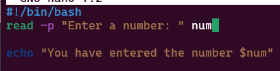

# linux-shell-scripting3
Control flow statements are the backbone of any programming language, including shell scripting (most commonly Bash) e.g if-else, for loops, while loops and case staements.

## Control Flow

Control flow refers to the order in which individual statements, instructions, or function calls are executed in a script.

**Task**

A script that asks for a number and then tells us if that number is positive, negative or zero.

Step 1: Create a file and name it "control_flow.sh"

Step 2: Write the script, save and execute.

Step 3: The Script Breakdown

* #!/bin/bash:This is called the shebang (pronounced "she-bang"). It tells the system this script should be run with a Bash interpreter.

* read -p "Enter a number: " num: read is a Bash built-in command used to get input from the user.": The -p option stands for "prompt." It displays the message "Enter a number: " to the user before waiting for input. 

* num: This is the name of the variable where the user's input will be stored. Whatever the user types and presses Enter, that text will go into the num variable.

Step 4: Modify the second line and use echo to display the variable stored in num variable.

* As explained above after the read command finishes, the script moves to the next line.

* The echo command then runs. It accesses the value stored in $num (using the $ prefix) and prints the complete message to the terminal.

Step 5: If Statement

* If: This keyword starts a conditional statement. It means "if the following condition is true, then execute the commands that comes after

* [ $num -gt 0 ]: This is the condition being tested.

* [ and ]: These are actually shorthand for the test command. They are used to evaluate expressions. Important: There must be spaces around the [ and ] and around $num, -gt, and 0.

* $num: This accesses the value of the num variable. If num holds "15", then $num becomes 15.

* -gt: This is a numeric comparison operator. It stands for "greater than." So, $num -gt 0 means "is the value of num greater than 0?"

* ; then: The semicolon ; is used to separate the condition from the then keyword on the same line. then indicates the start of the commands to execute if the if condition is true.

* Overall: "If the number the user entered is greater than zero, then..."

* echo "The number is positive."

* echo: This command simply prints the text that follows it to the standard output (your terminal screen).

* This line will only be executed if the condition [ $num -gt 0 ] was tr

Step 6. elif Statement

elif stands for "else if". allowing you to test additional conditionswere not met. It helps you add more layers of decision making to your script.

* elif [ $num -lt 0 ]; then

* elif: This stands for "else if." It introduces a second condition to be tested only if the previous if (or elif) condition was false.

* [ $num -lt 0 ]: This is the new condition.

* -lt: This is another numeric comparison operator, meaning "less than." So, $num -lt 0 means "is the value of num less than 0?"

* Overall: "If the first condition was false, then check: is the number the user entered less than zero? If yes, then..."

**LOOP**
Loops are fundamental control flow statements that allow you to repeat a block of commands multiple times. This is incredibly useful for automating repetitive tasks.

Bash primarily offers three types of loops:

* for loop: 

* while loop:u

* until loop:

### For Loop

The for loop is used when you want to perform an action for each item in a given list. We have two types

**Task**

1. List Form: This script demonstrates how to use a for loop to repeat a specific action (printing a message) a set number of times, with a changing element in the message.

Step 1: #!/bin/bash

* This is the shebang.

* It tells your operating system that this script should be executed using the /bin/bash interpreter (the Bash shell). It must be the very first line of the script.

Step 2. for i in 1 2 3 4 5

* This line starts a for loop.

* for: The keyword that initiates the loop.

* i: This is a variable name. In each turn (iteration) of the loop, i will temporarily hold one of the values from the list that follows in. You can choose any valid variable name here (e.g., count, number, item).

* in: This keyword separates the loop variable from the list of items it will iterate over.

* 1 2 3 4 5: This is the list of items that the loop will process. In this case, it's a list of numbers. The loop will run once for 1, then once for 2, and so on, until it has processed 5.

* Overall: "For each item in the list 1, 2, 3, 4, 5, put that item into the variable i and then do the following commands."

Step 3. do

* This keyword marks the beginning of the block of commands that will be executed repeatedly by the loop. Everything between do and done will be run for each item in the list.

Step 4. echo "Hello, World! This is message $i"

* echo: This command prints text to the terminal.

* "Hello, World! This is message $i": This is the string (text) that will be printed.

   * $i: This is where the magic happens! The $ sign tells Bash to substitute the variable i with its current value for that particular turn of the loop.

* How it works in each iteration:

    * 1st iteration: i is 1. The command becomes echo "Hello, World! This is message 1"

    * 2nd iteration: i is 2. The command becomes echo "Hello, World! This is message 2"

    * ...and so on, until the 5th iteration.

Step 5. done

* This keyword marks the end of the for loop block. Once the loop has processed all items in the list, the script will continue with any commands after done (or exit if there are no more commands).

How the Script Works (Step-by-Step Execution):

Step 1. The script starts.

Step 2. The for loop begins.

Step 3. Iteration 1:

    * The value 1 is assigned to the variable i.

    * The command echo "Hello, World! This is message 1" is executed, and "Hello, World! This is message 1" is printed to the terminal.

Step 4. Iteration 2:

    * The value 2 is assigned to the variable i.

    * The command echo "Hello, World! This is message 2" is executed, and "Hello, World! This is message 2" is printed.

Step 5. Iteration 3:

    * The value 3 is assigned to the variable i.

    * The command echo "Hello, World! This is message 3" is executed, and "Hello, World! This is message 3" is printed.

Step 6. Iteration 4:

    * The value 4 is assigned to the variable i.

    * The command echo "Hello, World! This is message 4" is executed, and "Hello, World! This is message 4" is printed.

Step 7. Iteration 5:

    * The value 5 is assigned to the variable i.

    * The command echo "Hello, World! This is message 5" is executed, and "Hello, World! This is message 5" is printed.

Step 8. The loop has now processed all items in the list. The script reaches done and then exits (as there are no more commands).

**Expected Output**

2. C-style Form: This form uses double parentheses ((...)) to handle arithmetic expressions for initialization, condition checking, and incrementing/decrementing.

Explanation:
Step 1. for (( i=0; i<5; i++ )); do

    * This is the line that defines the C-style for loop. The double parentheses ((...)) are crucial here; they tell Bash to treat the expressions inside as arithmetic operations, similar to how for loops work in C, Java, or JavaScript.

    * i=0 (Initialization):

        * This part runs only once at the very beginning of the loop.

        * It initializes a variable named i and sets its starting value to 0. This i will serve as our counter.

* i<5 (Condition):

    * This expression is evaluated before each iteration of the loop.

    * The loop will continue to execute the commands inside its body (do...done) as long as this condition is true.

    * In this case, the loop will run as long as the value of i is strictly less than 5.

* i++ (Increment):

    * his part runs at the end of each iteration (after the commands inside do...done have been executed).

    * i++ is a shorthand for i = i + 1. It increases the value of i by 1.

* do: This keyword marks the beginning of the commands that will be executed repeatedly by the loop.

* Overall: "Start with i at 0. As long as i is less than 5, do the following commands, and after each time, increase i by 1."

Step 2. echo "Number $i"

* echo: This command prints text to the standard output (your terminal).

* "Number $i": This is the string that will be printed.

    * $i: This is a variable substitution. Bash will replace $i with the current numerical value of the variable i during each iteration.

Step 3. done

   * This keyword marks the end of the for loop block. Once the loop's condition (i<5) becomes false, the script will exit the loop and continue with any commands after done (or exit if there are no more commands).

**How the Script Works (Step-by-Step Execution):**

Step 1. The loop starts.

Step 2. Initialization: i is set to 0.

Step 3. Iteration 1:

    * Condition Check: Is 0 < 5? Yes, it's true.

    * Execute Body: echo "Number 0" is run. Output: Number 0

    * Increment: i becomes 1.

Step 4. Iteration 2:

    * Condition Check: Is 1 < 5? Yes, it's true.

    * Execute Body: echo "Number 1" is run. Output: Number 1

    * Increment: i becomes 2.

Step 5. Iteration 3:

    * Condition Check: Is 2 < 5? Yes, it's true.

    * Execute Body: echo "Number 2" is run. Output: Number 2

    * Increment: i becomes 3.

Step 6. Iteration 4:

    * Condition Check: Is 3 < 5? Yes, it's true.

    * Execute Body: echo "Number 3" is run. Output: Number 3

    * Increment: i becomes 4.

Step 7. Iteration 5:

    * Condition Check: Is 4 < 5? Yes, it's true.

    * Execute Body: echo "Number 4" is run. Output: Number 4

    * Increment: i becomes 5.

Step 8. Final Check:

    * Condition Check: Is 5 < 5? No, it's false.

Step 9. The loop terminates.

**Expected Output**

